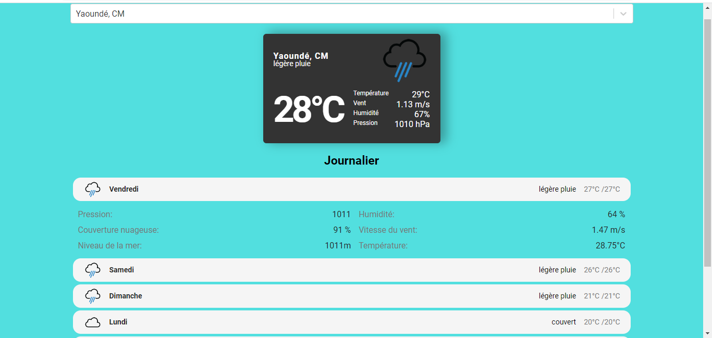
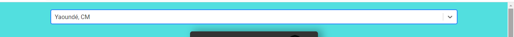
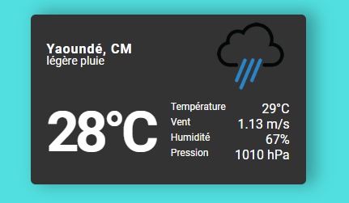
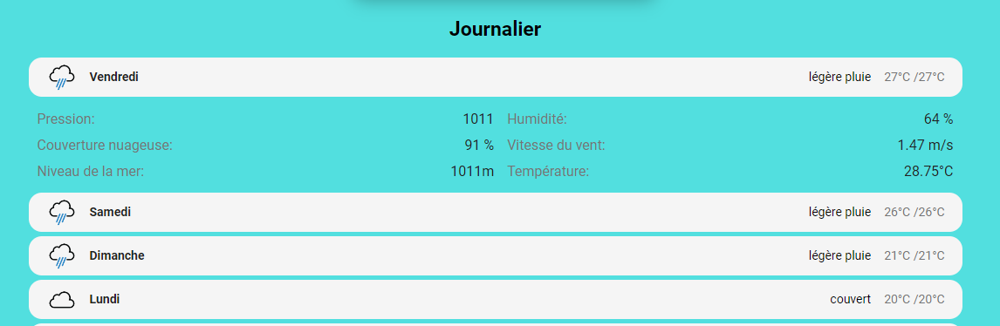

## Abyster Weather App

Application météo Reactjs construite avec l'API OpenWeatherMap montrant les données de météo d’une ville donnée sur une période de 7 jours

### application entière

### champ de recherche avec fonction de saisie semi-automatique

### météo actuelle

### prévisions quotidiennes

